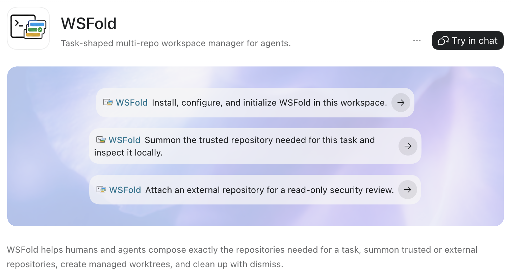

## The Problem

Real software systems often require changes that span multiple repositories, and even when work stays within a single service, doing it correctly still depends on a clear understanding of neighboring systems.

One way to address this is a monorepo: put everything in one place and make the whole codebase available.
But that comes with real costs. Monorepos expand the working context for both humans and LLM agents, put more load on the development environment, and usually depend on more complex build tooling. And once the codebase becomes too large, you still need ways to limit scope through partial checkouts or other workspace composition techniques.

## Solution

WSFold gives you a task-shaped alternative to a monorepo: a lightweight, temporary workspace composition of exactly the repositories you need for the work in front of you. Summon what matters, keep the context tight, and dismiss it again when the task is done.

You keep trusted repositories in a local directory and can also define trusted GitHub organizations for repositories that have not yet been cloned. Work does not happen directly in those storage locations. Instead, you start from any task-specific workspace directory and use `wsfold` to attach the repositories you need through the best available trusted attachment backend, remove them when they are no longer needed, and transparently clone trusted repositories on demand.

Technically, `wsfold` is a lightweight wrapper around Git plus workspace attachment backends such as Linux bind mounts, FUSE bind mounts, and symlinks. Its power comes from encoding a workspace composition pattern in software so it can be applied consistently at scale.

## Agents Can Use WSFold Directly

That model is useful for humans through an interactive CLI, but it becomes
especially powerful when workspace composition is delegated to an LLM agent.
WSFold ships with the `wsfold` skill, which `wsfold init` command installs locally, so
supported agents can find the repository needed for a task, summon it into the
workspace, create a managed worktree when edits are needed, and dismiss
repositories or worktrees when the task is done.

For example:

- For security or dependency review, the agent can attach an external repository
  after confirmation, inspect the actual code, and look for vulnerabilities,
  unexpected behavior, or unexpected network access.
- For deeper service or library research, the agent can use an MCP server or CLI
  search to discover a relevant repository, then stop reading through that
  narrow interface and summon the repository with WSFold for detailed local
  analysis.
- Inside a trusted organization, the agent can transparently summon the backend
  while implementing its client, so the client matches the real backend
  behavior. It can also summon a documentation repository from your organization
  and use it while implementing the task.

The `wsfold` skill can also be installed globally by installing this repository
as a plugin marketplace. See [Agent Skill](docs/agent-skill.md) for details.



## Installation

`wsfold` ships prebuilt binaries for macOS and Linux on `x86_64` and `ARM64`.
Windows is not currently supported.

There are three ways to install WSFold:

- install the CLI with Homebrew manually;
- download a prebuilt binary from GitHub Releases;
- ask your LLM agent to follow this README and install WSFold.

### Installation via Homebrew

If Homebrew is not installed yet, see the official instructions at [brew.sh](https://brew.sh/).

```bash
brew tap atilarum/wsfold
brew install wsfold
```

To update later:

```bash
brew update
brew upgrade wsfold
```

### Install from GitHub Releases

If Homebrew is not available, download the archive for your platform from the
[GitHub Releases page](https://github.com/atilarum/wsfold/releases), extract the
`wsfold` binary, and place it somewhere in your `PATH`.

### Installation via agent prompt

Ask your coding agent to install WSFold from this repository:

```text
Install the `wsfold` utility by following the Installation section in this README:
https://github.com/atilarum/wsfold#installation
```

The agent should prefer the Homebrew installation path and offer to install
Homebrew if it is missing. As a fallback, it may install `wsfold` by downloading
the prebuilt binary from GitHub Releases.

## Environment Setup

Before using `wsfold`, provide three pieces of information through environment
variables so it can compose a useful workspace. Point `WSFOLD_TRUSTED_DIR` at
the local directory that contains repositories you are comfortable opening in
your editor and running LLM agents against. Point `WSFOLD_EXTERNAL_DIR` at the
local directory that contains repositories you may want visible in a workspace,
but do not want treated as trusted. Set `WSFOLD_TRUSTED_GITHUB_ORGS` to GitHub
organizations whose repositories WSFold may clone and trust when they are not
available locally yet.

Add these environment variables to your shell profile, such as `~/.zshrc` or `~/.bashrc`:

```bash
export WSFOLD_TRUSTED_DIR="$HOME/repo/_prj"
export WSFOLD_EXTERNAL_DIR="$HOME/repo/_ext"
export WSFOLD_TRUSTED_GITHUB_ORGS="org_name,org_name2"
```

See [Environment Setup](docs/environment-setup.md) for the full list of
environment variables.

### GitHub CLI

Trusted remote discovery and on-demand cloning use GitHub CLI. Install `gh` and
authenticate once:

```bash
gh auth login
```

See the official GitHub CLI installation instructions at
[cli.github.com](https://cli.github.com/).

### Shell Completion

If you use Zsh, you can also enable shell completion by adding this to your
shell profile:

```bash
eval "$(wsfold completion zsh)"
```

## Quickstart

```bash
# Initialize the current directory as a WSFold workspace root and install local agent skills.
wsfold init

# Choose repositories to attach with the interactive picker.
wsfold summon

# Restore declared attachments and managed worktrees in a fresh checkout, on another machine, or in CI.
wsfold summon-all

# Inspect workspace health without changing files.
wsfold status

# Create a workspace-local managed worktree interactively.
wsfold worktree

# Dismiss repositories interactively when they are no longer needed for the task.
wsfold dismiss
```

## Agent Trust Boundaries

For WSFold to feel natural with coding agents, summoned trusted repositories
need the same sandbox access as the primary workspace. WSFold chooses the
attachment backend automatically: in capable Linux devcontainers it uses **native
bind mounts**, on Linux hosts with FUSE support it uses **FUSE bind mounts**, and
otherwise it falls back to **symlink** attachments, which is the default path on
macOS. WSFold automatically records original trusted repository checkout paths
as Codex **writable roots** and Claude Code **additional directories**, then maintains
those lists so agents can access the contents of those folders without
permission escalations. See [Linux FUSE Bind Backend](docs/linux-fuse-bind.md),
[Linux Devcontainer Native Bind Backend](docs/devcontainer-native-bind.md), and
[Agent Access Configuration](docs/agent-access-configuration.md) for details.

## External Repositories

External repositories remain outside the trusted workspace tree on purpose. For
humans, that lets editors such as Visual Studio Code keep their normal trust
prompts and safe-mode behavior for those roots. If a repository is trusted
enough to be treated like part of the main project, it should usually be moved
into the trusted repository set instead.

The same boundary matters for LLM-driven workflows: external repositories are
not treated as part of the default trusted workspace context. The bundled
`wsfold` skill teaches agents how to read `wsfold.yaml` and `.wsfold/cache.yaml`,
resolve declared external repositories, and inspect them as untrusted sources
without running code from those repositories.

## Workspace State Files

Commit `wsfold.yaml`; it is the portable workspace manifest that declares the
repositories, attachments, and managed worktrees needed by this workspace. Do
not commit `.wsfold/cache.yaml`; WSFold adds it to `.gitignore` and uses it only
for machine-local resolution state. With `wsfold.yaml` committed, `wsfold
summon-all` can restore the workspace on another machine or in CI, similar to a
package manager restoring dependencies from a manifest. See
[Workspace State Files](docs/workspace-state-files.md) for details.

## Visual Studio Code, Cursor, and Windsurf Integration

WSFold maintains a `.code-workspace` file so trusted and external repositories
attached to the workspace are immediately visible in Visual Studio Code and
compatible editors such as Cursor and Windsurf.

## Usage

All CLI commands and usage examples are described in [Usage](docs/usage.md).

## License

Licensed under the MIT. See [LICENSE](LICENSE).
